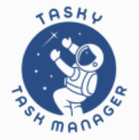

<a name="readme-top"></a>

<div align="center">
  <!-- You are encouraged to replace this logo with your own! Otherwise you can also remove it. -->
  

  <br/>

  <h1><b>Task Manager</b></h1>

</div>

<!-- TABLE OF CONTENTS -->

# 📗 Table of Contents

- [📖 About the Project](#about-project)
  - [🛠 Built With](#built-with)
    - [Tech Stack](#tech-stack)
    - [Key Features](#key-features)
  - [🚀 Live Demo](#live-demo)
- [💻 Getting Started](#getting-started)
  - [Prerequisites](#prerequisites)
  - [Usage](#usage)
- [👥 Authors](#authors)
- [🔭 Future Features](#future-features)
- [🤝 Contributing](#contributing)
- [⭐️ Show your support](#support)
- [🙏 Acknowledgements](#acknowledgements)
- [❓ FAQ](#faq)
- [📝 License](#license)

<!-- PROJECT DESCRIPTION -->

# 📖 Task Manager <a name="about-project"></a>

> Tasky - Task Manager

**Tasky** is a simple task manager with Google Authentication and Redux to manage state changes. Making it simple and fast.

## 🛠 Built With <a name="built-with"></a>

### Tech Stack <a name="tech-stack"></a>

> Powered by React + Redux + NextUI

<details>
<summary>React + Redux</summary>
  <ul>
    <li><a href=""></a></li>
    <li><a href=""></a></li>
  </ul>
</details>

<details>
<summary>Vite</summary>
  <ul>
    <li><a href=""></a></li>
  </ul>
</details>

<details>
<summary>NextUI</summary>
  <ul>
    <li><a href=""></a></li>
  </ul>
</details>

<details>
<summary>Tailwind CSS</summary>
  <ul>
    <li><a href=""></a></li>
  </ul>
</details>

<details>
<summary>Typescript</summary>
  <ul>
    <li><a href="">Typescript</a></li>
  </ul>
</details>

<details>
<summary>Framer Motion</summary>
  <ul>
    <li><a href=""></a></li>
  </ul>
</details>

<!-- Features -->

### Key Features <a name="key-features"></a>

> Key features:

- **Beautiful and Simple task manager**
- **Google SSO authentication**
- **Redux state management for faster UI**

<p align="right">(<a href="#readme-top">back to top</a>)</p>

<!-- LIVE DEMO -->

## 🚀 Live Demo <a name="live-demo"></a>

> You can view a live version of the app working here

- [Live Demo Link]()

<p align="right">(<a href="#readme-top">back to top</a>)</p>

<!-- GETTING STARTED -->

## 💻 Getting Started <a name="getting-started"></a>

> To get a local copy up and running, follow these steps.

### Prerequisites <a name="prerequisites"></a>

#### Clone repository

To clone the project, run the following command:

```bash
git clone https://github.com/nextui-org/vite-template.git
```

#### Install dependencies

You can use one of them `npm`, `yarn`, `pnpm`, `bun`, Example using `npm`:

```bash
npm install
```

### Usage <a name="usage"></a>

#### Run the development server

```bash
npm run dev
```

<p align="right">(<a href="#readme-top">back to top</a>)</p>

<!-- AUTHORS -->

## 👥 Author <a name="authors"></a>

👤 **Marcos Hernández Campos**

- Github: [@marcoshdezcam](https://github.com/marcoshdezcam)
- Twitter: [@MarcosHCampos](https://twitter.com/MarcosHCampos)
- Linkedin: [Marcos Hernández](https://linkedin.com/marcos-hernández-56058119a/)

<p align="right">(<a href="#readme-top">back to top</a>)</p>

<!-- FUTURE FEATURES -->

## 🔭 Future Features <a name="future-features"></a>

> Work in progress...

<p align="right">(<a href="#readme-top">back to top</a>)</p>

<!-- CONTRIBUTING -->

## 🤝 Contributing <a name="contributing"></a>

Contributions, issues, and feature requests are welcome!

Feel free to check the [issues page](../../issues/).

<p align="right">(<a href="#readme-top">back to top</a>)</p>

<!-- SUPPORT -->

## ⭐️ Show your support <a name="support"></a>

<p align="right">(<a href="#readme-top">back to top</a>)</p>

<!-- ACKNOWLEDGEMENTS -->

## 🙏 Acknowledgments <a name="acknowledgements"></a>

<p align="right">(<a href="#readme-top">back to top</a>)</p>

<!-- FAQ (optional) -->

## ❓ FAQ <a name="faq"></a>

<p align="right">(<a href="#readme-top">back to top</a>)</p>

<!-- LICENSE -->

## 📝 License <a name="license"></a>

This project is [MIT](./LICENSE) licensed.

<p align="right">(<a href="#readme-top">back to top</a>)</p>
